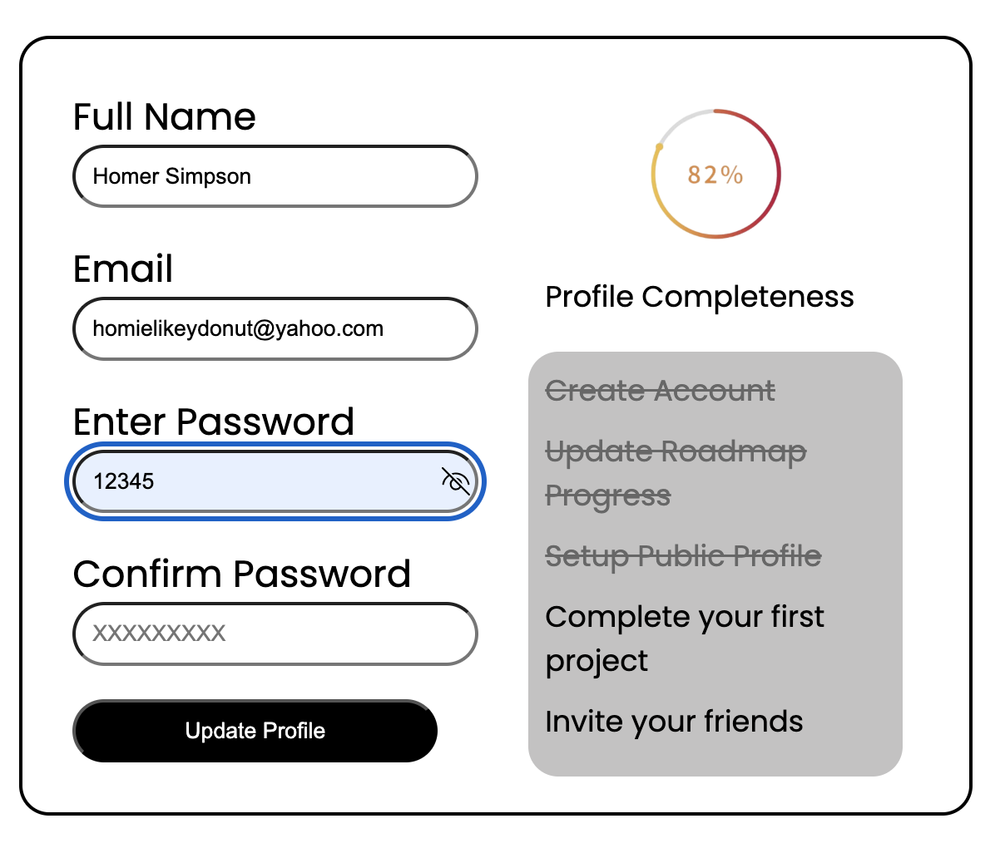

# Accessible Form UI

A static, accessible form UI built with only HTML and CSS. This project focuses on creating a user-friendly, accessible form that includes fields for full name, email, password, and confirm password, along with a password visibility toggle button, a completeness progress bar, and a checklist of form requirements.

---

## 📸 Preview

---

## 🚀 Features

- Semantic HTML structure with properly associated `<label>` elements
- Accessible form controls with ARIA attributes (`aria-required`, `aria-invalid`, `aria-live`)
- Keyboard-friendly focus styles for better navigation
- Password visibility toggle button (UI only, no JavaScript)
- Completeness progress bar and checklist UI components
- Responsive layout with flexible sizing
- High color contrast for readability and accessibility

---

## 📝 Original Brief

[Link to the original project brief](https://roadmap.sh/projects/accessible-form-ui)

---

## 🛠️ How to Use

Open the `index.html` file in a modern browser to view the form UI. This is a static UI component with no JavaScript functionality yet.

---

## 🧩 Future Improvements

- Add JavaScript to enable real-time form validation and password toggle functionality
- Connect the completeness progress bar and checklist to form validation logic
- Improve error messaging with dynamic content updates
- Enhance responsiveness for mobile devices

---

## 🎨 Font

This project uses the **Poppins** font from Google Fonts for a clean and modern look.

---

## 📋 Accessibility Notes

- All inputs have associated labels with the `for` attribute
- Focus states are styled clearly for keyboard users
- Error message containers use `aria-live="polite"` to announce changes
- Interactive elements like buttons have accessible names and keyboard support

---

## 🙌 Credits

Built by [Joshua Agbor]

---

Feel free to customize or let me know if you want me to generate a version with your specific details filled in!
